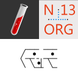

# Jekyll Snippets for Visual Studio Code

[Jekyll](https://jekyllrb.com) (a ruby based static page generator) snippets for [Visual Studio Code](https://code.visualstudio.com) which is published on [Visual Studio Marketplace](https://marketplace.visualstudio.com/items?itemName=kargware.vscode-extension-jekyll-kw) with the name `vscode-extension-jekyll-kw`. 

The code of the extension is hosted on [GitHub n13org/vscode-extension-jekyll](https://github.com/n13org/vscode-extension-jekyll)

See all extensions from Kargware on the [Marketplace](https://marketplace.visualstudio.com/manage/publishers/kargware)
